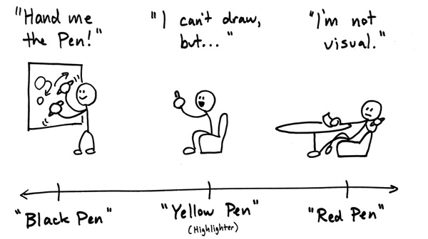

# Problems

> That's why they pay us the big money

> If the problem was easy, they wouldn't pay us like this

## Learning Objectives

- Demonstrate how to break a problem into relevant parts
- Demonstrate multiple solutions, identifying tradeoffs
- Indicate what is easily solvable
- Identify areas of high/low risk
-

## The Table Waiter Problem

Let's jump right in.  We'll work on a problem together and then discuss helpful practices and procedures.

Join your squad at a section of whiteboard and solve this problem.  Pick a representative to record the steps you take and practices you use.

- A waiter has N tables, each with 2-4 guests.
- The waiter makes rounds between each of their tables, the bar, and the kitchen.
- The waiter takes drink orders for a new table, then submits them to the bar.
- Drinks are delivered when all table orders are ready.
- The waiter takes food orders for a new table, then submits them to the kitchen.
- Food is delivered when all table orders are ready.
- The waiter checks idle tables for additional requests, then submits them appropriately.
- Additional requested items are delivered when all table orders are ready.

---

> Q. In one sentence, what problem did you solve?

---

### Steps ?

> Q. Going around the room, where going to build a frankenstein list of our steps.  Group 1 provides their step 1, Groups provides *their* step 2, and so on.

---

### Steps

- clarify the problem
- brainstorm
- organize/select
- prototype
- review
- doubledown or pivot

---

#### Clarify the problem:
> Seek first to understand, then to be understood. - Steven Covey

Make sure you are solving the right problem.  "Get out of the office" is a phrase often used to remind Founders that they need to get close to their users.  To see the customers using our app in their natural environment.

#### Brainstorm:
> What is now proved was once only imagined. - William Blake

No judgement.  Just ideas.  No lists. No categorization.  Use techniques that get ideas from all types of people; quiet/loud, writers/drawers, analytical/empathetic.  Use colors, crayons, paper, whiteboard.

#### Organize/Select:
> It is not enough to just do your best or work hard. You must know what to work on. - W. Edwards Deming (Father of ideas that made Toyota great, foundation for Lean Manufacturing)

The black pen people grab the pen and run to the board, drawing out their ideas.  The yellow pen people wait, then highlight what's important.  The red pen people wait even longer, then go to the board, cross out and redraw, further clarifying.

#### Prototype:
> Nobody ever got fired for hiring IBM. - the multitudes

Back in the day, IBM's claim to fame was starting 3 "skunk works" for any large project.  After an initial prototype, they would merge members and ideas from the three into one.

Get immediate ROI.

#### Review:
> By three methods we may learn wisdom: First, by reflection, which is noblest; Second, by imitation, which is easiest; and third by experience, which is the bitterest. - Confucius

Retrospectives provide the vehicle for improvement.

#### Doubledown or pivot:

Finally we need to decide, do we continue down the current path or do we face reality and change direction?

I read about a company that made extremely high quality drill bits.  Competition from overseas, provided bits that were good enough, but much cheaper.  This company realize that they weren't jazzed about drill bits, it was creating holes under exacting specifications.  So they pivoted, to making holes in tough materials, with innovative methods, like hydro-drilling.

---

> There are three principal means of acquiring knowledge... observation of nature, reflection, and experimentation.

> Observation collects facts;

> reflection combines them;

> experimentation verifies the result of that combination.

> Denis Diderot

---

## Practices:

> Q. (3 min) Pick 2 helpful practices and 1 anti-practice.

---

Practices:

- brainstorm
- prototype
- change the abstraction level
- paradigm shift
- phone a friend
- simplify

Shift Abstraction Level:
> Do not seek to follow in the footsteps of the men of old; seek what they sought. - Matsuo Basho

You can rarely solve a disagreement battling at the level of the problem.  Either go up to ensure you have the same goals.  Or go down to discuss an actual example.

Paradigm Shift:
> Turn frustration into fascination. - Jim Roan

"My flight leaves in 45 minutes. My taxi driver turns around, "The good news is we're only 10 miles from the airport. The bad news? We won't be there for about an hour and a half."  Suddenly I'm... fascinated.  Where are all these people going?  (Nowhere is the only appropriate answer)  Do they sit in this everyday?  Can I make it if I get out an walk?"

---

### Exercise:

http://github.com/ga-dc/problem_modeling

---

### Suggested Reading

- http://tompeters.com/cool-friends/roam-dan/
