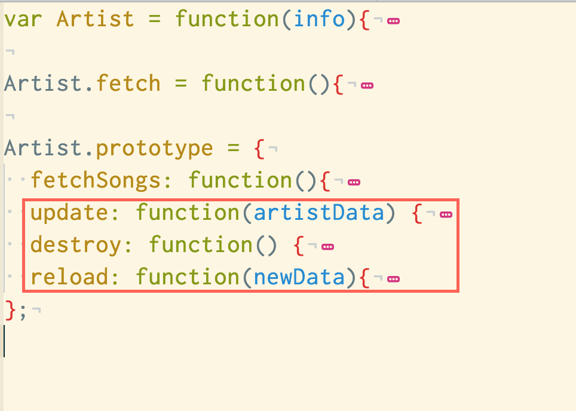

# OOJS on the Front End - Part Deux: Create, Update, Destroy

## Learning Objectives

- Use OOJS to structure front end code
- Build model objects that create, update, destroy data on the server
- Build view objects that render forms and interact with model objects
- Describe the role of model objects on the Front-end
- Describe the role of view objects on the Front-end

## Framing

Our goal for today is to complete our app so that we have basic CRUD
functionality for artists. This means we'll be able to Create, Edit/Update,
and Destroy artists. We won't really be adding functionality to songs, given
the time, but the same principles apply.

Overall, our app has a couple of parts that work together to create that lovely
Single Page App Experience (SPA® Experience) ;)

### The Database

Postgres stores our data in a structured manner, so that we can find/update/destroy
quickly.

### The Backend

The backend exposes our app's data and functionality to the web (via HTTP). The
backend has a few parts:

* `app.js` - Loads express and other libraries, as well as the other parts of our app
  * `models` (Sequelize) -  these serve as the interface to the database, so our express app
    can easily interact with our data
  * `controllers` - define what routes our app responds to, and how to respond...
    this is usually by either finding data and returning it as JSON, or accepting
    JSON data to edit/update our DB
  * `views` - define how our app sends back HTML (when needed). In our case, our
    app only really sends back the `layout.hbs`, which is used to send the initial
    page to the user. This page provides the skeleton of our SPA, and also tells
    the user's browser to load the appropriate front-end JS.
  * `public` - where our front-end JS lives. This is in public so it can be sent
    to the user's browser.

### The Front-End

Our front-end code runs in the browser, and interfaces with the backend (over
HTTP) to request or update data, and then render the appropriate HTML.

* `script.js` - this is the main file that waits for the page to finish loading,
  and then starts up our app. In this case, it fetches all artists, and then
  displays them.
  * `models` - these classes are responsible for representing our data in a
  structured way, and for providing an interface to sync that data with the
  server. This keeps the rest of our code (i.e. views) clean of ajax requests.
  * `views` - these classes are responsible for:
    * rendering models into HTML
    * responding to events (clicking on buttons, etc) appropriately

## Overview of Today's Front-end

### Turn & Talk (10 minutes)

Look at the following two pictures... they show a summary of the methods we're
going to have at the end of today in our views. The highlighted ones are the
ones we'll be working on in this lesson.

Take 5 minutes to talk with your partner about what you think each method is
supposed to do.

#### Artist Model Methods

#### Artist Model Methods

## Editing Artists
### Adding the Edit Button
### Making the "Edit" Template
### Rendering the Edit View
### Swapping Out the `el`

## Updating Artist on Submission
### The `updateArtist` method
### Adding `update` and `reload` methods to our Artist model
### Updating the `el` (show updated artist info)

## Deleting Artists
### Adding the "Delete" button (on the Edit Form)
### Responding to the Delete Action
### Adding the `destroy` method to our Artist Model
### Updating the View (Fading Out the `el`)

## Creating New Artists

## Summary
