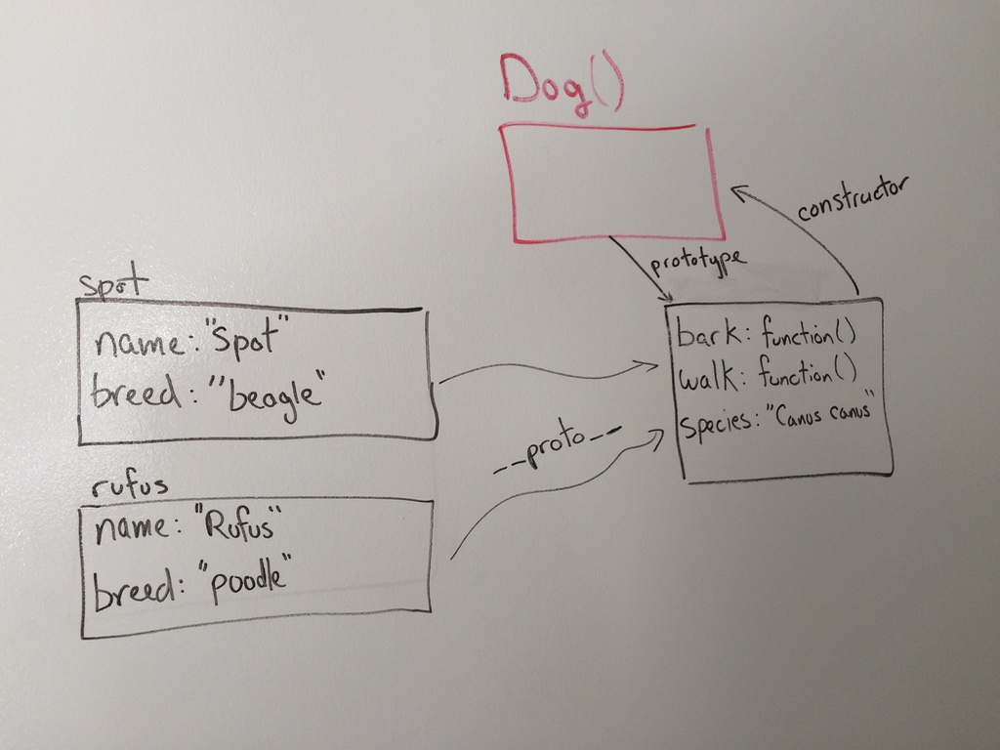
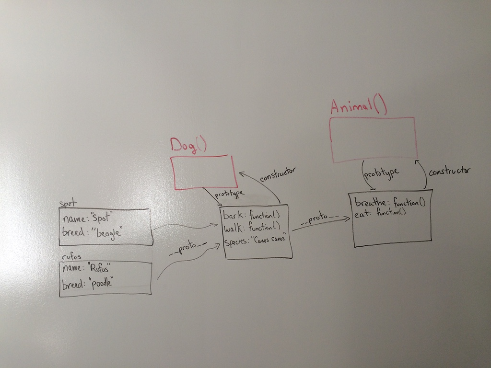

# Javascript Prototypes and Constructors

## Learning Objectives

- Explain the importance of OOJS in front-end code
- Describe the role of constructor functions, and how they work
- Use constructor functions and the `new` keyword to create objects with shared properties (like classes)
- Describe what a prototype object is, and how they are used in JS
- Differentiate between `__proto__` and Animal.prototype
- Diagram the relationship between an object, its constructor, and prototype
- Compare `Object.create` vs constructors
- Compare / contrast classical and prototypal inheritance
- Use the Chrome element inspector to traverse through the prototypal tree.

## Object Orientation (10 minutes)

Hi! This is an object: `{}`. Now you're oriented.


Objects in JavaScript are a bit different from the ones you are used to from
ruby, but many of the same object-oriented design principles you applied when
writing your rails apps can apply when writing front-end JavaScript.

What is the definition of an object? An object encapsulates related data and
behavior. Why might we want to do this? Object-oriented programming provides us
with opportunities to clean up our procedural code and model it more-closely to
the external world.

This becomes **very** important as our front-end code grows in complexity. Even
a simple app like DoSomething will have lots of code on the front end to do
things like:

* render data from the back end
* update the state of the page as data changes
* respond to events like clicking buttons / links
* send requests to the back end to fetch / update / destroy data

Suppose we were building a card game (this example doesn't matter front-end vs back-end). We'd start by building a deck. What does
the deck of cards look like? Perhaps:

```js
var deck = ["Ace of Spades", "2 of Diamonds", "Queen of Diamonds", ... ] // etc
```

To a reader, it's immediately obvious that we have a deck of cards. But, when we go to use our data structure, say in a game of high card, we notice a few problems.

```js
// does the Ace of Spades beat the 2 of Diamonds? How do we compare strings?
var card0 = deck[0]; //=> "Ace of Spades"
var card1 = deck[1]; //=> "2 of Diamonds"
if ( translate(card0) > translate(card1) ) {
  return "Player 1 wins!";
} else {
  return "Player 2 wins!";
}
```

We've had to write a whole other global method just translate card faces into
numerical values for comparison. You can see how this code is *proecdural*: we
do things step by step, manually creating values as we go in order to accomplish
our work. Instead, we might have taken an object-oriented approch:

```js
var deck = [
  {
    face: "Ace of Spades",
    numValue: 14,
    suit: "Spades",
    value: "Ace",
    beat: function beat (otherCard) {
      this.numValue > otherCard.numValue ? true : false
    }
  },
  { ... }, ...] // etc
```

There is still a lot of repetition in our object code. We'll see how to take
care of this in a moment. But, for now, notice how our comparison code is much
simpler:

```js
deck[0].beat(deck[1]) ? "Player 1 wins!" : "Player 2 wins!"
```

The reason this is simpler is easy: we've encapsulated the comparison logic in
the card object itself, as well as each card's numerical value. Additionally,
each card has a well-defined interface (the data and methods that can be
accessed / called)

## Making Objects (10 minutes)

So far, we've had to make our objects 'by hand', i.e. using object literals:

```js
var celica = {
  model: 'Toy-Yoda Celica',
  color: 'limegreen',
  fuel: 100,
  drive: function() {
    this.fuel--;
    return 'Vroom!';
  },
  refuel: function() {
    this.fuel = 100;
  }
}

var civic = {
  model: 'Honda Civic',
  color: 'lemonchiffon',
  fuel: 100,
  drive: function() {
    this.fuel--;
    return 'Vroom!';
  },
  refuel: function() {
    this.fuel = 100;
  }
}
```

Notice how much duplication there is in that code! Just imagine if we needed a
hundred cars in our app!!

As you may have noticed, some of these properties change between cars (model
and color), and others stay the same, for example, `fuel` starts at 100, and
`drive` and `refuel` are the same functions for every car.

Why don't we build a function that makes these objects for us!

### Exercise (10 minutes)

Define a function: `makeCar()` that takes two parameters (model, color) and
makes a new object literal for a car using those params, and returns that object.

For example:
```js
// This should return a car object just like the previous example
var celica = makeCar("Toy-Yoda Celica", "limegreen");
```

See solution in `car.js`

## Constructor Functions (20 minutes)

It's so common that we need to make objects with similar properties / methods
that programming languages usually have some features to help with this. In
Ruby, we have **classes** which can create **objects**, or **instances** of
that class.

Javascript doesn't really have classes, instead we use constructor functions and
prototypes to achieve similar results. (Note: the newest version, ES6, adds
classes, but they're really just syntactic sugar, behind the scenes it's still
using constructors and prototypes).

Constructor functions are a lot like the `makeCar` function we just created, but
they're supported by JS and we use the `new` keyword to use the constructor
function.

Note that constructor functions start with a capital letter to make it obvious
that they are constructors. This isn't necessary, but is a convention and you
should follow it!

```js
function Person(initialName) {
  this.name = initialName;
  this.species = "Homo Sapiens";
  this.speak = function() {return "Hello! I'm " + this.name};
}

var adam = new Person("Adam");
var bob =  new Person("Bob");

adam.name // "Adam"
adam.speak() // "Hello! I'm Adam"

bob.name // "Bob"
bob.speak() // "Hello! I'm Bob"
```

Notice the use of `this`, and the fact that we don't return anything. Here's why
we write constructor functions this way:

When we run a constructor function with `new`, Javascript will automatically:

1. Create an new, empty object for us.
2. Call the constructor function on that object (this -> the new object)
3. Return the object

### Exercise: Car Constructor Function (10 minutes)

Write a constructor function to replace our `makeCar` function earlier.

See car.js for a solution.

## Lunch

## Prototypes (20 minutes)

There's one problem with our constructor function... every time we create a new
car, it's creating new copies of the `refuel` and `drive` functions. This isn't
really necessary, since those functions are exactly the same for every car.

Creating all these copies can cause our program to use more memory than it
really needs to.

Thankfully, by using **prototypes**, we can eliminate this duplication. Every
object in JS has a `prototype` property, that points to another **object**.
Almost always, the prototype of a given object will come from it's
**constructor** (which has a prototype).

Any properties / methods defined on an object's prototype are available on the
that object. An example:

```js
function Dog(name, breed) {
  this.name = name;
  this.breed = breed;
}

Person.prototype.species = "Canis Canis";
Person.prototype.bark = function() { return "Woof! I'm " + this.name; }


// OR Alternate form:
// The disadvantage here is that we're overwriting any existing properties on
// the prototype
Dog.prototype = {
  species = "Canis Canis",
  speak: function() { return "Woof! I'm " + this.name; }
}

// Our objects work just as they did before!
var spot = new Person("Spot", "Beagle");
var rufus =  new Person("Rufus", "Poodle");

spot.name // "Spot"
spot.breed // "Beagle"
adam.bark() // "Hello! I'm Adam"

rufus.name // "Rufus"
rufus.bark() // "Hello! I'm Rufus"
```



To see an object's prototype, you can look at the `.__proto__` property. It's
generally not a good idea to change the prototype directly by assigning to the
`__proto__` property.

**Note**: `.prototype` is a property on constructor functions, while `.__proto__` is the
property on objects, and is used in the lookup chain.

### Exercise: Car Constructor with Prototypes (10 minutes)

Update the constructor function for our car to define the methods on prototypes
rather than on the individual instances themselves.

See `car.js` for a solution.

## Exercise: Monkey (20 minutes)

Work on the [OOP Monkey Exercise](https://github.com/ga-dc/oop_monkey/tree/js) (same as in Ruby, now in JS!).

Make sure you check out the `js` branch before beginning!

`$ git checkout js`

## Inheritance (15 minutes)

In general, we're not going to be using inheritance with javascript, but it's
worth just mentioning how it can be accomplished.

```js
////////////////////////////////
// Animal (Parent) Class
////////////////////////////////
function Animal( name ){
  this.name = name;
}

Animal.prototype.kingdom = "Animalia";
Animal.prototype.breathe = function() {console.log("Inhale... exhale...")};


////////////////////////////////
// HELLO THIS IS DOG
////////////////////////////////
function Dog(name, breed){
  this.name = name;
  this.breed = breed;
}

// Important! Set up the link in the prototype chain connecting Dogs to Animals
Dog.prototype = new Animal();

// Add any methods / properties shared by all dogs.
Dog.prototype.bark = function(){ console.log("Woof")};
Dog.prototype.species = "Canis canis"

////////////////////////////////
// Testing our dawgs
////////////////////////////////
var spot = new Dog("Spot", "Beagle");

// from Animal prototype
spot.kingdom;
spot.breathe();

// from Dog prototype
spot.bark();
spot.species;

// from Dog properties
spot.name;
spot.breed;
```



## Object.create (20 minutes)

So we won't use this often (if ever in this class), but you may see examples
of using `Object.create`. This method creates a new object, and sets the
prototype of the new object to be the existing object.

An example might help:

```js
var Person = {
  species: "Homo Sapiens",
  speak: function() { console.log("Hello")}
};

var me = Object.create(Person);

me.speak();
me.species;
```

Just like before, we can use `this` inside our methods:

```js
var Person = {
  species: "Homo Sapiens",
  speak: function() { console.log("Hello! I'm " + this.name)}
};

var me = Object.create(Person);
me.name = "Adam";

me.speak()
me.species
```


## Sample Questions

* What are constructor functions and the new keyword? How are they related?
* What is a prototype? Why do we care about them?
* Describe how we use prototypes to set up inheritance in JS
